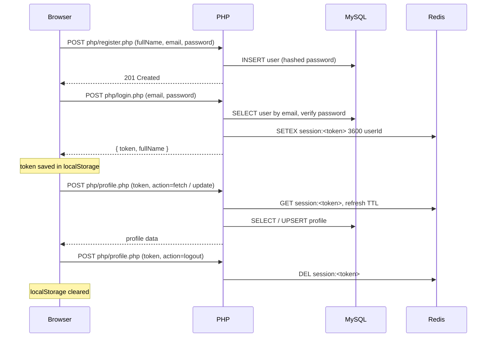

# User Portal

A user management web app with a **Register → Login → Profile** flow. It uses jQuery AJAX for every request, a PHP backend, MySQL for storage and Redis for server-side sessions.

## Features

- **Register** with full name, email and password. The password is hashed with `password_hash`, and duplicate emails are rejected.
- **Log in** with email and password. The server issues a random session token that is stored in Redis.
- **Profile page** shows the user's details, with an **Edit profile** form for age, date of birth, contact number and address.
- **Log out** deletes the session from Redis and clears the browser storage.
- **Validation in the browser** on every form. Errors appear inline under each field, and the fields are linked with `aria-describedby` for screen readers.
- **Responsive layout** built with Bootstrap 5, so it works on mobile, tablet and desktop.

## Tech stack

| Layer | Technology |
| --- | --- |
| Frontend | HTML5, CSS3, Bootstrap 5.3, jQuery 3.7 |
| Backend | PHP 7.4+ (`mysqli`, `phpredis`) |
| Database | MySQL 5.7+ / MariaDB 10.3+ |
| Session store | Redis |
| Deployment | Docker (PHP 8.3 + Apache) |

## How the task requirements are met

| Requirement | Implementation |
| --- | --- |
| HTML, CSS, JS and PHP in separate files | Each page is split across `*.html`, `css/style.css`, `js/*.js` and `php/*.php`, and no file mixes languages |
| Bootstrap forms | All forms use Bootstrap 5 form controls and validation styles |
| jQuery AJAX only, no form submission | Every form handler calls `event.preventDefault()` and sends the data with `$.ajax` |
| MySQL with prepared statements | Every query uses `mysqli::prepare` and `bind_param`, with no string concatenation |
| Redis for backend sessions | On login, a token → user id mapping is stored in Redis with a TTL |
| Browser localStorage for the session, no PHP sessions | The token is kept in `localStorage`, and `session_start()` is never used |

## How it works



### Session design

- The token is 64 hex characters from `random_bytes(32)`, which is cryptographically secure.
- Redis stores `guvi:session:<token>` → user id with a 1-hour expiry (`SESSION_TTL_SECONDS`).
- The expiry slides: every profile request resets the TTL, so active users stay logged in.
- The token format is checked before Redis is queried, and a missing or expired token returns `401`, which sends the user back to the login page.
- Logging out deletes the key immediately, so the token cannot be reused.

## API reference

Every endpoint accepts `POST` only (anything else returns `405`) with form-encoded data, and responds with JSON:

```json
{ "success": true, "message": "...", "data": {} }
```

| Endpoint | Parameters | Responses |
| --- | --- | --- |
| `php/register.php` | `fullName`, `email`, `password` | `201` created, `409` email already registered |
| `php/login.php` | `email`, `password` | `200` returns `{ token, fullName }`, `401` invalid credentials |
| `php/profile.php` | `token`, `action=fetch` | `200` returns the profile, `401` session expired |
| `php/profile.php` | `token`, `action=update`, `age`, `dob`, `contact`, `address` | `200` returns the updated profile, `401` session expired |
| `php/profile.php` | `token`, `action=logout` | `200` logged out |

Unexpected server errors are logged with `error_log` and return a generic `500` message, so internal details never reach the browser.

## Database schema

See [`sql/schema.sql`](sql/schema.sql).

- **`users`**: `id`, `full_name`, `email` (unique), `password_hash`, `created_at`
- **`user_profiles`**: `user_id` (primary key and foreign key to `users.id`, `ON DELETE CASCADE`), `age`, `dob`, `contact`, `address`, `updated_at`

Profile details live in a separate table, so a user can register without them. Updates use `INSERT … ON DUPLICATE KEY UPDATE`, which creates the profile row on the first save and updates it afterwards.

## Validation rules

| Field | Rule |
| --- | --- |
| Full name | Required, 2–100 characters, letters, spaces, `.`, `'` and `-` only |
| Email | Required, valid format, at most 255 characters |
| Password (register) | 8–72 characters, with at least one uppercase letter, one lowercase letter and one number |
| Confirm password | Must match the password |
| Age | Optional, whole number from 1 to 120, and must match the date of birth if both are filled in |
| Date of birth | Optional, not in the future, not more than 120 years ago |
| Contact | Optional, 10–15 digits, may start with `+` |
| Address | Optional, 5–255 characters |

## Project structure

```
├── assets/
│   └── logo.svg
├── css/
│   └── style.css
├── js/
│   ├── common.js        # localStorage session helpers, alerts, button loading state
│   ├── validation.js    # field rules and inline error handling
│   ├── register.js
│   ├── login.js
│   └── profile.js
├── php/
│   ├── config.php       # .env loader, MySQL and Redis connections, JSON responses
│   ├── register.php
│   ├── login.php
│   ├── profile.php
│   └── router.php       # router for PHP's built-in server (blocks dot-files such as .env)
├── sql/
│   └── schema.sql
├── index.html           # redirects to login.html
├── register.html
├── login.html
├── profile.html
├── .env.example
├── .htaccess            # blocks dot-files on Apache
└── Dockerfile
```

## Running locally

### Prerequisites

- PHP 7.4 or newer with the `mysqli`, `mbstring`, `openssl` and `redis` extensions enabled
  - On Windows, download the `php_redis` DLL that matches your PHP version from the [PECL Windows releases](https://downloads.php.net/~windows/pecl/releases/redis/) and enable it in `php.ini`
- A MySQL server (local or hosted, for example Aiven)
- A Redis server (local or hosted, for example Redis Cloud)

### Steps

1. **Clone the repository**

   ```bash
   git clone https://github.com/KamatchiKarthi/guvi-inter.git
   cd guvi-inter
   ```

2. **Create the database and tables**

   ```bash
   mysql -u root -p < sql/schema.sql
   ```

3. **Configure the environment**

   Copy `.env.example` to `.env` and fill in your details:

   | Variable | Description | Default |
   | --- | --- | --- |
   | `DB_HOST` | MySQL host | `127.0.0.1` |
   | `DB_PORT` | MySQL port | `3306` |
   | `DB_USER` | MySQL user | `root` |
   | `DB_PASSWORD` | MySQL password | *(empty)* |
   | `DB_NAME` | Database name | `guvi_internship` |
   | `DB_SSL` | Set to `true` for hosted MySQL that requires SSL | `false` |
   | `DB_SSL_CA` | Optional path to a CA certificate for verifying the server | *(empty)* |
   | `REDIS_HOST` | Redis host | `127.0.0.1` |
   | `REDIS_PORT` | Redis port | `6379` |
   | `REDIS_PASSWORD` | Redis password | *(empty)* |

   Real environment variables, such as those set by a hosting provider, take priority over `.env`.

4. **Start the server**

   ```bash
   php -S 127.0.0.1:8765 php/router.php
   ```

5. Open [http://127.0.0.1:8765](http://127.0.0.1:8765). You are redirected to the login page.

## Deployment (Docker)

The `Dockerfile` builds PHP 8.3 with Apache and the `mysqli` and `redis` extensions, and listens on the port the host provides in `$PORT`.

```bash
docker build -t user-portal .
docker run -p 8080:80 --env-file .env user-portal
```

To deploy on [Render](https://render.com) for free:

1. Create a **New → Web Service**, select this repository and choose the **Docker** runtime.
2. Add the variables from the table above under **Environment**.
3. Deploy and open the generated URL.

## Security

- Passwords are hashed with `password_hash` (bcrypt) and checked with `password_verify`.
- Every SQL query uses prepared statements, which prevents SQL injection.
- Session tokens are random and short-lived, and they are revoked on the server at logout.
- Login failures return the same message whether the email or the password was wrong, so accounts cannot be discovered by guessing emails.
- `.env` is excluded from git and Docker builds, and web requests for it are blocked (`.htaccess` on Apache, `php/router.php` on the built-in server).
- Values shown on the page are inserted with jQuery's `.text()`, never as HTML, which prevents XSS.
